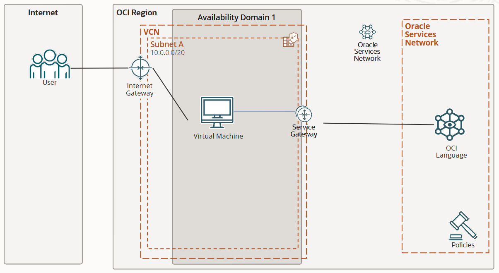

# OCI Language and Batch Translation

[](https://img.shields.io/badge/license-UPL-green) [](https://sonarcloud.io/dashboard?id=oracle-devrel_oci-language-translation)

## Introduction

The OCI Language Service is a serverless, multitenant service that provides users with pretrained and custom models to analyze *unstructured text* and extract insights without the need for Data Science or Machine Learning expertise.

The Language service can be accessed via REST API, SDK, or  CLI, and is suitable for tasks requiring text analysis at scale.

These are the following available features:

- [Language Detection](https://docs.oracle.com/en-us/iaas/language/using/lang-detect.htm#lang-detect): detecting languages based on the provided text - with a confidence score.
- [Text Classification](https://docs.oracle.com/en-us/iaas/language/using/ner.htm#ner): identifying document category and subcategories, to which the text belongs to.
- [Named Entity Recognition](https://docs.oracle.com/en-us/iaas/language/using/ner.htm#ner) (NER): identify entities, places, locations, emails... within text.
- [Key Phrase Extraction](https://docs.oracle.com/en-us/iaas/language/using/key_ref.htm#key_ref): extracts the most important set of phrases from a text or a block of text.
- [Sentiment Analysis](https://docs.oracle.com/en-us/iaas/language/using/sentment.htm#sentiment): analyzes the sentiment score from provided text: it can be positive, neutral, or negative.
- [Text Translation](https://docs.oracle.com/en-us/iaas/language/using/translate-text.htm): batch translate text into any language of choice (as long as it's [in the supported list of languages](https://docs.oracle.com/en-us/iaas/language/using/translate-text.htm)).
- [Personal Identifiable Information (PII)](https://docs.oracle.com/en-us/iaas/language/using/pii.htm#translate): detects private information in the text (credit cards, IP addresses, phone numbers, emails, telephone numbers, names,...) and **obscures/hides** it.

With all these features available, the Language service automates sophisticated text analysis, saving you time and resources.

We will use OCI's Python SDK to access OCI Language, and once we have some code ready, we will invoke it in a pipeline to create an AI-Enhanced Wall Street Market Analyzer. This POC aims to teach that, through data, any type of project is achievable with AI, facilitated by services like OCI Language and a bit of creativity.

This idea realies on the concept about group decisions: it's been statistically proven that the most picked choice by a group of people is often the correct one. Based on this, if I wanted to short or long a stock, I would need to listen to what people are saying: if people are clearly having a negative consensus on a day, perhaps that day isn't the best day to buy, and viceversa. This automated averaged sentiment analyzer takes Tweets from the official Twitter API (querying by stock $NAME on search results), batch-analyzes the sentiment of these tweets, and produces a positive / negative recommendation.

You can use this recommendation to assist your buy/sell options on specific stocks.

There's the possibility to create your own custom models for Text Classification and Named Entity Recognition, although we will not explore their benefits in this use case. [Have a look here](https://docs.oracle.com/en-us/iaas/language/using/custom-models.htm#custom-models) if you're interested.

## 0. Prerequisites and setup

- Oracle Cloud Infrastructure (OCI) Account with available credits to spend
- [OCI Language Overview](https://docs.oracle.com/en-us/iaas/language/using/overview.htm#language)
- [Oracle Cloud Infrastructure (OCI) Language Documentation](https://docs.oracle.com/en-us/iaas/language/using/home.htm)
- [Python 3.10](https://www.python.org/downloads/release/python-3100/)
- [Conda](https://conda.io/projects/conda/en/latest/user-guide/install/index.html)
- [OCI SDK](https://docs.oracle.com/en-us/iaas/Content/API/Concepts/sdkconfig.htm)

Follow these links below to generate a config file and a key pair in your ~/.oci directory:

- [SDK Config](https://docs.oracle.com/en-us/iaas/Content/API/Concepts/sdkconfig.htm)
- [API Signing Key](https://docs.oracle.com/en-us/iaas/Content/API/Concepts/apisigningkey.htm)
- [SDK CLI Installation](https://docs.oracle.com/en-us/iaas/Content/API/SDKDocs/cliinstall.htm#configfile)

After completion, you should have following 2 things in your ~/.oci directory:

- A config file(where key file point to private key:key_file=~/.oci/oci_api_key.pem)
- A key pair named oci_api_key.pem and oci_api_key_public.pem
- Now make sure you change the reference of key file in config file (where key file point to private key:key_file=/YOUR_DIR_TO_KEY_FILE/oci_api_key.pem)

First, we install dependencies:

```bash
pip install -r requirements.txt
```

After, you will have two scripts:

- `language.py`: contains the implementation of using every service available in OCI Language (so far).
- `market_analysis.py`: contains the use case code. Firstly, it will take a JSON-formatted list of tweets (you can connect any data source or comment from any user), translate them into English first, and once it has them in the same language, it will perform an averaged sentiment analysis of those tweets.

The console will ask for how many synthetic users' data you want. For testing purposes, this can be any small value that will let us test; for your own use case in practice, your only job is to select which data will go into the vector database, and in which form (JSON, structured data, raw text... and their properties (if any)).

## 1. Test all services

You can execute this following command:

```bash
cd scripts/
python language.py
```

It will run all available features in OCI Language against the string found in line 19:

```python
test_string = "Oracle Cloud Infrastructure is built for enterprises seeking higher performance, lower costs, and easier cloud migration for their applications. Customers choose Oracle Cloud Infrastructure over AWS for several reasons: First, they can consume cloud services in the public cloud or within their own data center with Oracle Dedicated Region Cloud@Customer. Second, they can migrate and run any workload as is on Oracle Cloud, including Oracle databases and applications, VMware, or bare metal servers. Third, customers can easily implement security controls and automation to prevent misconfiguration errors and implement security best practices. Fourth, they have lower risks with Oracle’s end-to-end SLAs covering performance, availability, and manageability of services. Finally, their workloads achieve better performance at a significantly lower cost with Oracle Cloud Infrastructure than AWS. Take a look at what makes Oracle Cloud Infrastructure a better cloud platform than AWS."
```

You can replace this with whichever test data string you want to apply OCI Language.

## 2. Run stock market sentiment analyzer

To run this Proof-of-concept market sentiment analyzer, just run the following command. It will assume that you have a JSON list of tweets in data/ and expect you to reference these files where you have data in the script.

```bash
cd scripts/
python market_analysis.py
```

## Demo

TODO

## Tutorial

TODO

## Physical Architecture



## Contributing

This project is open source. Please submit your contributions by forking this repository and submitting a pull request! Oracle appreciates any contributions that are made by the open source community.

## License

Copyright (c) 2022 Oracle and/or its affiliates.

Licensed under the Universal Permissive License (UPL), Version 1.0.

See [LICENSE](LICENSE) for more details.

ORACLE AND ITS AFFILIATES DO NOT PROVIDE ANY WARRANTY WHATSOEVER, EXPRESS OR IMPLIED, FOR ANY SOFTWARE, MATERIAL OR CONTENT OF ANY KIND CONTAINED OR PRODUCED WITHIN THIS REPOSITORY, AND IN PARTICULAR SPECIFICALLY DISCLAIM ANY AND ALL IMPLIED WARRANTIES OF TITLE, NON-INFRINGEMENT, MERCHANTABILITY, AND FITNESS FOR A PARTICULAR PURPOSE.  FURTHERMORE, ORACLE AND ITS AFFILIATES DO NOT REPRESENT THAT ANY CUSTOMARY SECURITY REVIEW HAS BEEN PERFORMED WITH RESPECT TO ANY SOFTWARE, MATERIAL OR CONTENT CONTAINED OR PRODUCED WITHIN THIS REPOSITORY. IN ADDITION, AND WITHOUT LIMITING THE FOREGOING, THIRD PARTIES MAY HAVE POSTED SOFTWARE, MATERIAL OR CONTENT TO THIS REPOSITORY WITHOUT ANY REVIEW. USE AT YOUR OWN RISK.
